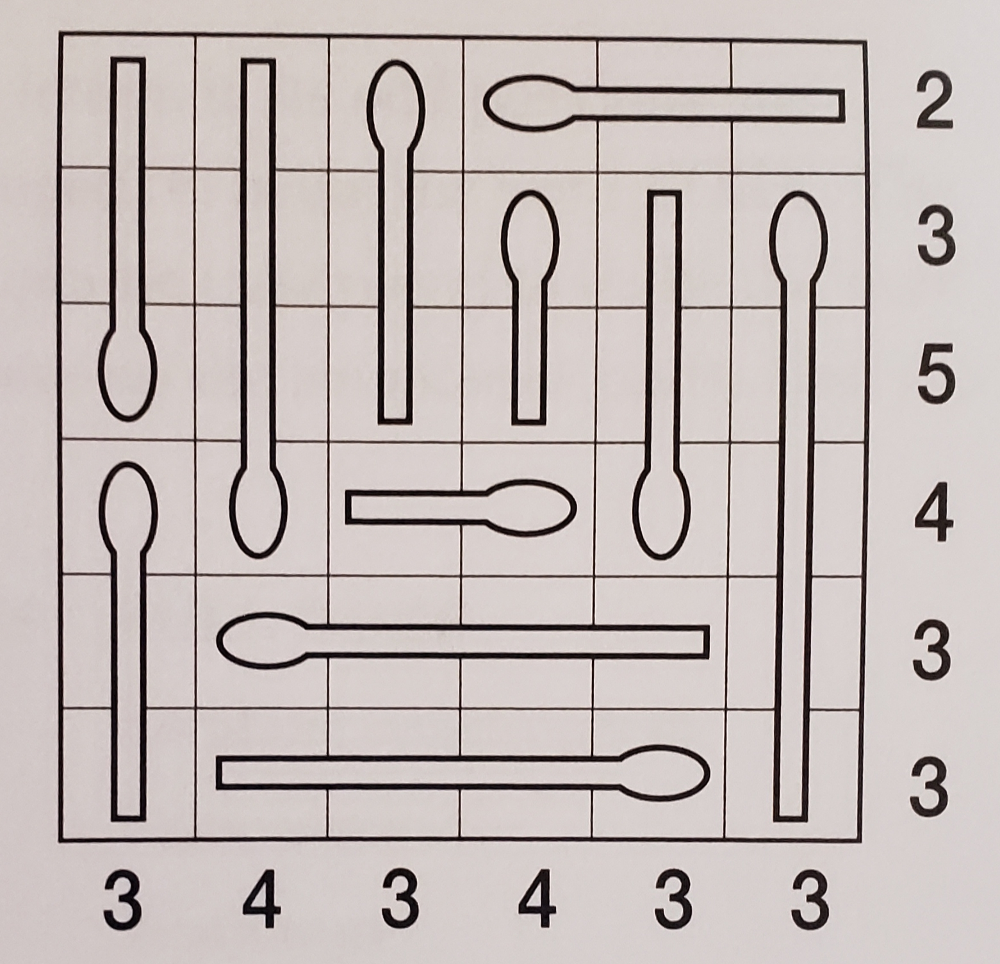

# Matchstick Puzzle Generator

This is a program that generates matchstick puzzles, like this one:

The following rules apply for any matchstick puzzle:
- Each cell in the grid is either burnt or not burnt
- The numbers along the left and bottom reflect the number of burnt cells in the respective row or column
- A match can be unburnt, partially burnt, or entirely burnt
- A match only burns from its head (the rounded end) to its tail, without skipping segment.

# Running the Generator
When you run `GeneratorMain::main`, the program generates matchstick puzzles and prints them to the command line.
The number, size, and difficulty of puzzles output can be configured by changing the `private static final` fields in `GeneratorMain`.
- Note 1: Currently, it takes this program unreasonably long to create puzzles larger than about 8x8, since the generator is written pretty naively.
- Note 2: There's no objective measure of difficulty, so this uses a heuristic based on how many logical steps the solver needs to reach a solution.

### Interpreting the output
When the code prints out a generated puzzle, it will look like this:
```
Seed: 2321454851821980672
Difficulty: 22
 v  <  <  <  ^  v  3
 v  ^  >  >  ^  v  3
 v  ^  >  >  ^  v  2
 ^  ^  <  <  ^  v  2
 ^  >  >  <  <  ^  1
 >  >  >  >  >  ^  1
 1  3  1  2  4  1 
```
- `Seed` is a random seed that you can use to re-generate the puzzle in the future (described more below)
- The numbers along the board represent the number of burnt cells in the row or column, as in the image above
- The arrows in the cells point in the direction of the match's head.
(Note: this does make it impossible to differentiate two matches if one's head leads into the other's tail.
It is assumed throughout the solving code that this situation never happens, so the generator always avoids this.)

# Running the Solver
If you're stuck on a puzzle, you can set `seed` in `SeedSolverMain::main` to the seed of the puzzle, and run it to get the solution.

Alternatively, you can manually create the puzzle in `ManualSolverMain` to get a solution if you don't have the seed.

### Interpreting the output
After running either of these, the output will be like the following:
```
 >_  >_  >_  >X  v_  v_  1
 <_  <_  >_  >X  v_  v_  1
 ^X  v_  v_  v_  v_  v_  1
 ^_  vX  vX  v_  vX  vX  4
 ^_  >_  >_  >_  >_  vX  1
 ^_  >_  >_  >X  >X  >X  3
 1   1   1   3   2   3  
```
This is the same as the board, as described above, but with `X` next to each burnt cell and `_` next to each unburnt cell.
If the solver cannot resolve what some cells are (which shouldn't happen for a generated puzzle), then the cell will have a `?` next to it.

# Future Extentions
- Better graphics for viewing the generated puzzles
- Improving the puzzle-generation algorithm to allow for generation of larger puzzles
- ~~If the current solver gives up on a puzzle, try brute-force solving it~~
    - Add an option for this in the generator, since it takes a lot of work to try all solutions
    - If any puzzles can be solved in this manner, try finding the logic behind it and incorporating that into the solver